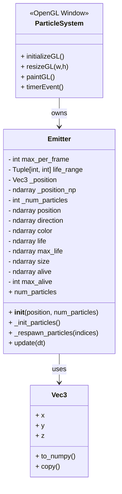
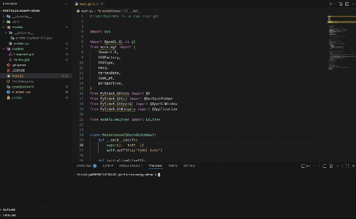

# Particle System — NumPy GPU Implementation

This project implements a **high-performance GPU particle system** in Python using:

- **NumPy** for vectorized particle simulation
- **PyOpenGL** for rendering
- **PySide6** (`QOpenGLWindow`) for real-time visualization
- **ncca.ngl** helpers (ShaderLib, VAOFactory, Vec3, etc.)

The emitter updates thousands of particles using vectorized operations and streams the particle attributes (position + color) directly to GPU buffers every frame.

---

## Demo

This section describes the program function by running the `main.py` executable file.

